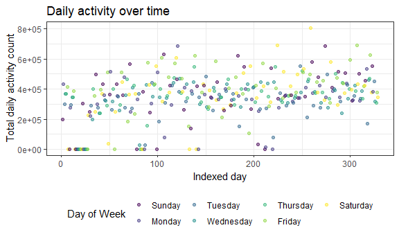

p8105\_mtp\_sal2222
================
Stephen Lewandowski
October 26, 2018

-   [Introduction](#introduction)
-   [Accelerometer Dataset Description](#accelerometer-dataset-description)
-   [Activity over time](#activity-over-time)
-   [Day of week effect](#day-of-week-effect)
-   [Daily activity profiles](#daily-activity-profiles)

### Introduction

### Accelerometer Dataset Description

The initial dataset consists of 329 observations and 1442 variables. This dataset includes separate activity count variables for each minute of the day.

``` r
activity_df <- read_csv(file = "./data/p8105_mtp_data.csv") %>%
  janitor::clean_names() %>% 
  gather(key = daily_min, value = activity, activity_1:activity_1440) %>% 
  mutate(daily_min = str_replace(daily_min, "activity_", ""),
         daily_min = as.numeric(daily_min),
         day = ordered(day, levels = c("Sunday", "Monday", "Tuesday", "Wednesday", "Thursday", 
"Friday", "Saturday"))) %>% 
  arrange(week, day, daily_min)

activity_df
```

    ## # A tibble: 473,760 x 4
    ##     week day    daily_min activity
    ##    <int> <ord>      <dbl>    <dbl>
    ##  1     1 Sunday         1        1
    ##  2     1 Sunday         2        1
    ##  3     1 Sunday         3        1
    ##  4     1 Sunday         4        1
    ##  5     1 Sunday         5        1
    ##  6     1 Sunday         6        1
    ##  7     1 Sunday         7        1
    ##  8     1 Sunday         8        1
    ##  9     1 Sunday         9        1
    ## 10     1 Sunday        10        1
    ## # ... with 473,750 more rows

After data wrangling, my resulting dataset consists of 473760 observations representing each minute and 4 variables for week, day of week, minute of the day, and activity count score.

A `skimr` skim review shows that there are no missing values for any of the variables, each day of the week appears 67,680 times, there are 47 weeks of data, and the mean activity count score is 240.34 with a range from 1 - 10,417.

A histogram view of activity counts indicates a very right-skewed distribution with a large peak at the baseline count value of 1. A boxplot view illustrates a large number of extreme outliers. It is unclear whether these measurements are due to periods of more intense activity or are due to instrument error. An empirical cumulative distribution function (ECDF) plot of activity shows that the distribution curve approaches `1.00` at an activity count of approximately `2500`.

The value `1` appears 204507 times, accounting for 43.1667933 percent of all observations. At the upper end of the distribution, there are 1489 observations above `2500`, 183 above `5000`, and 20 above `7500`.

``` r
ecdf_p <- activity_df %>% 
    ggplot(aes(x = activity)) +
    stat_ecdf(geom = "step") +
    labs(
    title = "Activity count empirical \ncumulative distribution function",
    x = "Activity count",
    y = "Cumulative density"
  )

hist_p <- activity_df %>% 
  filter(activity < 2500 & activity > 1) %>% 
  ggplot(aes(x = activity)) + 
  geom_histogram(bins = 200) +
  labs(
    title = "Activity count histogram \n(1 < Activity < 2500)",
    x = "Activity count",
    y = "Count"
  )

(ecdf_p + hist_p)
```


### Activity over time

``` r
activity_df %>%
  group_by(week, day) %>% 
  summarize(daily_activity = sum(activity))
```

    ## # A tibble: 329 x 3
    ## # Groups:   week [?]
    ##     week day       daily_activity
    ##    <int> <ord>              <dbl>
    ##  1     1 Sunday           196937.
    ##  2     1 Monday           432751.
    ##  3     1 Tuesday          297427 
    ##  4     1 Wednesday        369436.
    ##  5     1 Thursday         366178.
    ##  6     1 Friday           416166.
    ##  7     1 Saturday           1440 
    ##  8     2 Sunday             1440 
    ##  9     2 Monday           275175.
    ## 10     2 Tuesday          293202.
    ## # ... with 319 more rows

``` r
activity_df %>%
  group_by(week, day) %>% 
  summarize(daily_activity = sum(activity)) %>%
  ungroup() %>% 
  mutate(day_index = row_number()) %>% 
  ggplot(aes(x = day_index, y = daily_activity)) + 
  geom_point(aes(color = day), alpha = .5) + 
  labs(
    title = "Daily activity over time",
    x = "Indexed day",
    y = "Total daily activity count"
  ) + 
  viridis::scale_color_viridis(
    name = "Day of Week", 
    discrete = TRUE
  )
```



Explore the hypothesis that the participant became more active over time

### Day of week effect

``` r
activity_df %>%
  group_by(day) %>% 
  summarize(dow_mean_activity = mean(activity),
            dow_median_activity = median(activity),
            dow_sd_activity = sd(activity))
```

    ## # A tibble: 7 x 4
    ##   day       dow_mean_activity dow_median_activity dow_sd_activity
    ##   <ord>                 <dbl>               <dbl>           <dbl>
    ## 1 Sunday                 250.                11.0            510.
    ## 2 Monday                 220.                32.             369.
    ## 3 Tuesday                213.                32.             352.
    ## 4 Wednesday              236.                53.0            376.
    ## 5 Thursday               247.                64.0            387.
    ## 6 Friday                 271.                64.0            462.
    ## 7 Saturday               245.                32.             425.

Examine the possibility that day of the week affects activity (in isolation and in addition to the effect of time).

### Daily activity profiles

Make a visualization that shows the 24-hour activity “profiles” for each day. Also visualize effects of time and day of the week on 24-hour activity profiles; incorporating smooth estimates of mean activity profiles may clarify these effects. Comment on relationships you think are interesting.

``` r
activity_df %>%
  group_by(week, day) %>%
  mutate(min_index = row_number()) %>% 
  ggplot(aes(x = min_index, y = activity)) + 
  geom_point(aes(color = day), alpha = .5) + 
  labs(
    title = "Daily activity profiles",
    x = "Minute of day",
    y = "Activity count"
  ) + 
  viridis::scale_color_viridis(
    name = "Day of Week", 
    discrete = TRUE
  )
```


``` r
wordcountaddin::text_stats("p8105_mtp_sal2222.Rmd")
```

| Method          | koRpus      | stringi       |
|:----------------|:------------|:--------------|
| Word count      | 292         | 274           |
| Character count | 1829        | 1828          |
| Sentence count  | 17          | Not available |
| Reading time    | 1.5 minutes | 1.4 minutes   |
