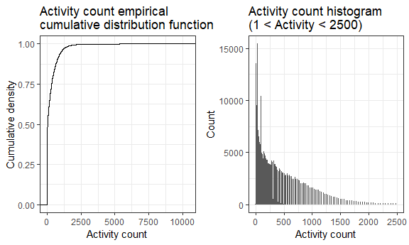
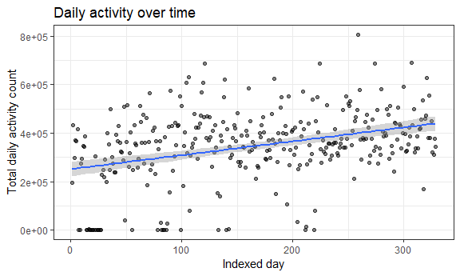
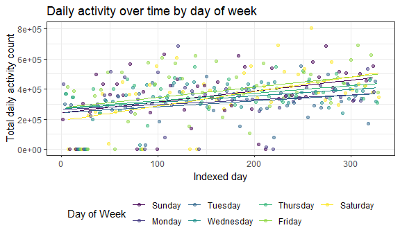
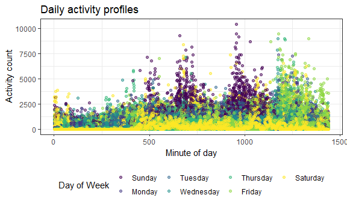

p8105\_mtp\_sal2222
================
Stephen Lewandowski
October 26, 2018

-   [Introduction](#introduction)
-   [Accelerometer dataset description](#accelerometer-dataset-description)
-   [Activity over time](#activity-over-time)
-   [Day of week effect](#day-of-week-effect)
-   [Daily activity profiles](#daily-activity-profiles)

Introduction
------------

Accelerometer dataset description
---------------------------------

The initial dataset consists of 329 observations and 1442 variables. This dataset includes separate activity count variables for each minute of the day.

``` r
activity_df <- read_csv(file = "./data/p8105_mtp_data.csv") %>%
  janitor::clean_names() %>% 
  gather(key = daily_min, value = activity, activity_1:activity_1440) %>% 
  mutate(daily_min = str_replace(daily_min, "activity_", ""),
         daily_min = as.numeric(daily_min),
         day = ordered(day, levels = c("Sunday", "Monday", "Tuesday", "Wednesday", "Thursday", 
"Friday", "Saturday"))) %>% 
  arrange(week, day, daily_min)

activity_df
```

    ## # A tibble: 473,760 x 4
    ##     week day    daily_min activity
    ##    <int> <ord>      <dbl>    <dbl>
    ##  1     1 Sunday         1        1
    ##  2     1 Sunday         2        1
    ##  3     1 Sunday         3        1
    ##  4     1 Sunday         4        1
    ##  5     1 Sunday         5        1
    ##  6     1 Sunday         6        1
    ##  7     1 Sunday         7        1
    ##  8     1 Sunday         8        1
    ##  9     1 Sunday         9        1
    ## 10     1 Sunday        10        1
    ## # ... with 473,750 more rows

After data wrangling, my resulting dataset consists of 473760 observations representing each minute and 4 variables for week, day of week, minute of the day, and activity count score.

A `skimr` skim review shows that there are no missing values for any of the variables, each day of the week appears 67,680 times, there are 47 weeks of data, and the mean activity count score is 240.34 with a range from 1 - 10,417.

A histogram view of activity counts indicates a very right-skewed distribution with a large peak at the baseline count value of 1. A boxplot view illustrates a large number of extreme outliers. It is unclear whether these measurements are due to periods of more intense activity or are due to instrument error. An empirical cumulative distribution function (ECDF) plot of activity shows that the distribution curve approaches `1.00` at an activity count of approximately `2500`.

The value `1` appears 204507 times, accounting for 43.1667933 percent of all observations. At the upper end of the distribution, there are 1489 observations above `2500`, 183 above `5000`, and 20 above `7500`.

``` r
ecdf_p <- activity_df %>% 
    ggplot(aes(x = activity)) +
    stat_ecdf(geom = "step") +
    labs(
    title = "Activity count empirical \ncumulative distribution function",
    x = "Activity count",
    y = "Cumulative density"
  )

hist_p <- activity_df %>% 
  filter(activity < 2500 & activity > 1) %>% 
  ggplot(aes(x = activity)) + 
  geom_histogram(bins = 200) +
  labs(
    title = "Activity count histogram \n(1 < Activity < 2500)",
    x = "Activity count",
    y = "Count"
  )

(ecdf_p + hist_p)
```



Activity over time
------------------

I will explore the hypothesis that the participant became more active over time by first examining a scatterplot of the indexed day from 1 to 329 and the aggregated total dialy activity.

``` r
activity_df %>%
  group_by(week, day) %>% 
  summarize(daily_activity = sum(activity)) %>%
  ungroup() %>% 
  mutate(day_index = row_number()) %>% 
  ggplot(aes(x = day_index, y = daily_activity)) + 
  geom_point(alpha = .5) +
  geom_smooth(method = lm, se = TRUE) +
    geom_smooth(method = loess, se = FALSE, color = "black", size = 0.5) +
  labs(
    title = "Daily activity over time",
    x = "Indexed day",
    y = "Total daily activity count"
  ) 
```



A LOESS curve and linear regression line both show increased activity over the span of the study period.

``` r
activity_df %>%
  group_by(week, day) %>% 
  summarize(daily_activity = sum(activity)) %>%
  ungroup() %>% 
  mutate(day_index = row_number()) %>%
  lm(daily_activity ~ day_index, data = .) %>% 
  broom::tidy() %>% 
  knitr::kable(digits = 2)
```

| term        |   estimate|  std.error|  statistic|  p.value|
|:------------|----------:|----------:|----------:|--------:|
| (Intercept) |  251538.51|   15716.21|      16.01|        0|
| day\_index  |     573.01|      82.55|       6.94|        0|

The output from a simple linear regression model shows that the activity increase over time is statistically significant. For each one day increase, the total daily activity count increases by 573 units (p &lt; 0.00001).

Day of week effect
------------------

I will next examine the possibility that day of the week affects activity.

First, I examine summary statistics by day of week to compare the effect in isolation.

``` r
activity_df %>%
  group_by(day) %>% 
  summarize(mean = mean(activity),
            median = median(activity),
            sd = sd(activity)) %>% 
  knitr::kable(digits = 2)
```

| day       |    mean|  median|      sd|
|:----------|-------:|-------:|-------:|
| Sunday    |  249.71|      11|  510.46|
| Monday    |  220.35|      32|  369.17|
| Tuesday   |  213.26|      32|  352.49|
| Wednesday |  236.19|      53|  376.11|
| Thursday  |  247.17|      64|  387.30|
| Friday    |  270.76|      64|  461.99|
| Saturday  |  244.93|      32|  424.81|

A review of mean and median activity counts shows some variation by day of week, but there is not an apparent increase or decrease over the course of the week or difference between weekday and weekend.

``` r
activity_df %>%
  group_by(week, day) %>% 
  summarize(daily_activity = sum(activity)) %>%
  ungroup() %>% 
  mutate(day_index = row_number()) %>% 
  ggplot(aes(x = day_index, y = daily_activity, color = day)) + 
  geom_point(alpha = .5) +
  geom_smooth(method = lm, se = FALSE, size = 0.5) +
  labs(
    title = "Daily activity over time by day of week",
    x = "Indexed day",
    y = "Total daily activity count"
  ) + 
  viridis::scale_color_viridis(
    name = "Day of Week", 
    discrete = TRUE
  )
```



Next, I will again plot activity over time, but include linear regression lines for each day of the week. Now, we see that activity increased over time for each day, but the slopes show that the rate increased more for the weekends than the weekdays. Saturday in particular started of with the lowest activity counts in the initial months, and ended the study period in the high end of activity. Friday activity was consistently a high activity day and Tuesday was consistently a lower activity day.

Daily activity profiles
-----------------------

Make a visualization that shows the 24-hour activity “profiles” for each day. Also visualize effects of time and day of the week on 24-hour activity profiles; incorporating smooth estimates of mean activity profiles may clarify these effects. Comment on relationships you think are interesting.

``` r
activity_df %>%
  group_by(week, day) %>%
  mutate(min_index = row_number()) %>% 
  ggplot(aes(x = min_index, y = activity)) + 
  geom_point(aes(color = day), alpha = .5) + 
  labs(
    title = "Daily activity profiles",
    x = "Minute of day",
    y = "Activity count"
  ) + 
  viridis::scale_color_viridis(
    name = "Day of Week", 
    discrete = TRUE
  )
```



``` r
wordcountaddin::text_stats("p8105_mtp_sal2222.Rmd")
```

| Method          | koRpus      | stringi       |
|:----------------|:------------|:--------------|
| Word count      | 497         | 473           |
| Character count | 3017        | 3016          |
| Sentence count  | 28          | Not available |
| Reading time    | 2.5 minutes | 2.4 minutes   |
