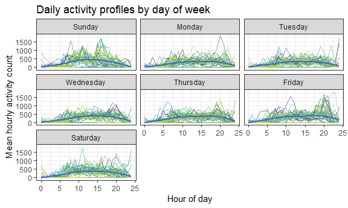

p8105\_mtp\_sal2222
================
Stephen Lewandowski
October 26, 2018

-   [Introduction](#introduction)
-   [Accelerometer dataset description](#accelerometer-dataset-description)
-   [Activity over time](#activity-over-time)
-   [Day of week effect](#day-of-week-effect)
-   [Daily activity profiles](#daily-activity-profiles)

Introduction
------------

This project examines 47 weeks of accelerometer device data from a 63 year-old male with congestive heart failure with a goal of understanding patterns of physical activity over time.

Accelerometer dataset description
---------------------------------

The initial dataset consists of 329 observations and 1442 variables. This dataset includes separate activity count variables for each minute of the day.

``` r
activity_df <- read_csv(file = "./data/p8105_mtp_data.csv") %>%
  janitor::clean_names() %>% 
  gather(key = daily_min, value = activity, activity_1:activity_1440) %>% 
  mutate(daily_min = str_replace(daily_min, "activity_", ""),
         daily_min = as.numeric(daily_min),
         day = ordered(day, levels = c("Sunday", "Monday", "Tuesday", "Wednesday", "Thursday", 
"Friday", "Saturday"))) %>% 
  arrange(week, day, daily_min)

activity_df
```

    ## # A tibble: 473,760 x 4
    ##     week day    daily_min activity
    ##    <int> <ord>      <dbl>    <dbl>
    ##  1     1 Sunday         1        1
    ##  2     1 Sunday         2        1
    ##  3     1 Sunday         3        1
    ##  4     1 Sunday         4        1
    ##  5     1 Sunday         5        1
    ##  6     1 Sunday         6        1
    ##  7     1 Sunday         7        1
    ##  8     1 Sunday         8        1
    ##  9     1 Sunday         9        1
    ## 10     1 Sunday        10        1
    ## # ... with 473,750 more rows

After data wrangling, the resulting dataset consists of 473760 observations representing each minute and 4 variables for week, day of week, minute of the day, and activity count score.

A `skimr` skim review shows that there are no missing values for any of the variables, each day of the week appears 67,680 times, there are 47 weeks of data, and the mean activity count score is 240.34 with a range from 1 - 10,417.

A histogram shows a right-skewed distribution with a peak at the baseline count value of 1. A boxplot indicates a large number of extreme outliers. A cumulative distribution plot shows that the curve approaches `1.00` at a count of approximately `2500`.

``` r
activity_df %>% 
  filter(activity < 2500 & activity > 1) %>% 
  ggplot(aes(x = activity)) + 
    geom_histogram(binwidth = 20, 
                   color = "black", 
                   aes(fill = ..count..)) +
    viridis::scale_fill_viridis(
        name = "Count", 
        discrete = FALSE
      ) +
    geom_density(aes(y = 20 * ..count..)) +
    labs(
      title = "Activity count histogram",
      x = "Activity count",
      y = "Count",
      caption = "Counts between 1 and 2500"
    ) +
     theme(legend.position = "none") 
```


The value `1` appears 204507 times, accounting for 43.1667933 percent of all observations. At the upper end of the distribution, there are 1489 observations above `2500`, 183 above `5000`, and 20 above `7500`.

Activity over time
------------------

To assess activity over time, I first examined a scatterplot of the 329 indexed days and aggregated total daily activity.

``` r
activity_df %>%
  group_by(week, day) %>% 
  summarize(daily_activity = sum(activity)) %>%
  ungroup() %>% 
  mutate(day_index = row_number()) %>% 
  ggplot(aes(x = day_index, y = daily_activity)) + 
    geom_point(alpha = .5) +
    geom_smooth(method = lm, se = TRUE) +
    geom_smooth(method = loess, se = FALSE, color = "black", size = 0.5) +
    labs(
      title = "Daily activity over time",
      x = "Indexed day",
      y = "Total daily activity count"
    ) 
```


A LOESS curve and linear regression line both show increased activity over the span of the study period. The linear line fits the data reasonably.

``` r
activity_df %>%
  group_by(week, day) %>% 
  summarize(daily_activity = sum(activity)) %>%
  ungroup() %>% 
  mutate(day_index = row_number()) %>%
  lm(daily_activity ~ day_index, data = .) %>% 
  broom::tidy() %>% 
  knitr::kable(digits = 2)
```

| term        |   estimate|  std.error|  statistic|  p.value|
|:------------|----------:|----------:|----------:|--------:|
| (Intercept) |  251538.51|   15716.21|      16.01|        0|
| day\_index  |     573.01|      82.55|       6.94|        0|

A regression model shows that daily activity increase over time is statistically significant. For each one day increase, the total daily activity count increases by 573 units (p &lt; 0.00001).

Day of week effect
------------------

I examined day of week summary statistics to assess the effect in isolation.

``` r
activity_df %>%
  group_by(day) %>% 
  summarize(mean = mean(activity),
            median = median(activity),
            sd = sd(activity)) %>% 
  knitr::kable(digits = 2)
```

| day       |    mean|  median|      sd|
|:----------|-------:|-------:|-------:|
| Sunday    |  249.71|      11|  510.46|
| Monday    |  220.35|      32|  369.17|
| Tuesday   |  213.26|      32|  352.49|
| Wednesday |  236.19|      53|  376.11|
| Thursday  |  247.17|      64|  387.30|
| Friday    |  270.76|      64|  461.99|
| Saturday  |  244.93|      32|  424.81|

A review of mean and median activity counts shows some variation by day of week, but there is not an apparent increase or decrease over the course of the week.

Boxplots and ridgeline plots by day of week display similar distribution patterns.

``` r
activity_df %>%
  group_by(week, day) %>% 
  summarize(daily_activity = sum(activity)) %>%
  ungroup() %>% 
  mutate(day_index = row_number()) %>% 
  ggplot(aes(x = day_index, y = daily_activity, color = day)) + 
    geom_point(alpha = .5) +
    geom_smooth(method = lm, se = FALSE, size = 0.5) +
    labs(
      title = "Daily activity over time by day of week",
      x = "Indexed day",
      y = "Total daily activity count"
    ) + 
    viridis::scale_color_viridis(
      name = "Day of Week", 
      discrete = TRUE
    )
```


Linear regression lines for each day of the week, indicate that activity increased over time for each day. The slopes show that the rate increased more for the weekends compared to weekdays. Saturday had the lowest activity counts in the initial months and ended with the highest counts. Friday activity was consistently high and Tuesday activity was consistently low.

Daily activity profiles
-----------------------

The plot below visualizes the profile of hourly activity for each day, with a LOESS curve indicating the overall pattern. We see the participant's activity gradually increase from midnight to around 10 AM, and then remain steady until around 5:30 PM, when it begins to decline for the evening.

``` r
activity_df %>%
  group_by(week, day) %>%
  mutate(min_index = row_number(),
         hour_index = as.integer((min_index / 60)))  %>% 
  ungroup %>%
  group_by(week, day, hour_index) %>% 
  summarize(mean_hourly = mean(activity)) %>%
  unite(week_day, week, day, sep = "_", remove = FALSE) %>%
  filter(mean_hourly < 2000) %>% 
  ggplot(aes(x = hour_index, y = mean_hourly)) + 
    geom_line(aes(color = week_day, alpha = 0.1), size = 0.1) +
    geom_smooth(method = loess, se = TRUE, size = 1.0) +
    labs(
      title = "Daily activity profiles",
      x = "Hour of day",
      y = "Mean hourly activity count"
    ) + 
    viridis::scale_color_viridis(
      name = "Day", 
      discrete = TRUE
    ) +
    theme(legend.position = "none") 
```


Over 10-week periods, the daily 24-hour patterns appears similar, but counts grow larger by the fifth 10-week period. The day of the week profile patterns are also similar, but indicate that the participant stay active later in the evening on Fridays and reduces activity earlier on Sundays.

``` r
activity_df %>%
  group_by(week, day) %>%
  mutate(min_index = row_number(),
         hour_index = as.integer((min_index / 60)))  %>% 
  ungroup %>%
  group_by(week, day, hour_index) %>% 
  summarize(mean_hourly = mean(activity)) %>%
  unite(week_day, week, day, sep = "_", remove = FALSE) %>%
  filter(mean_hourly < 2000) %>% 
  ggplot(aes(x = hour_index, y = mean_hourly)) + 
    geom_line(aes(color = week_day, alpha = 0.1), size = 0.1) +
    geom_smooth(method = loess, se = TRUE, size = 1.0) +
    facet_wrap(~day) +
    labs(
      title = "Daily activity profiles by day of week",
      x = "Hour of day",
      y = "Mean hourly activity count"
    ) + 
    viridis::scale_color_viridis(
      name = "Day", 
      discrete = TRUE
    ) +
    theme(legend.position = "none") 
```



``` r
wordcountaddin::text_stats("p8105_mtp_sal2222.Rmd")
```

| Method          | koRpus      | stringi       |
|:----------------|:------------|:--------------|
| Word count      | 496         | 472           |
| Character count | 3041        | 3040          |
| Sentence count  | 30          | Not available |
| Reading time    | 2.5 minutes | 2.4 minutes   |
